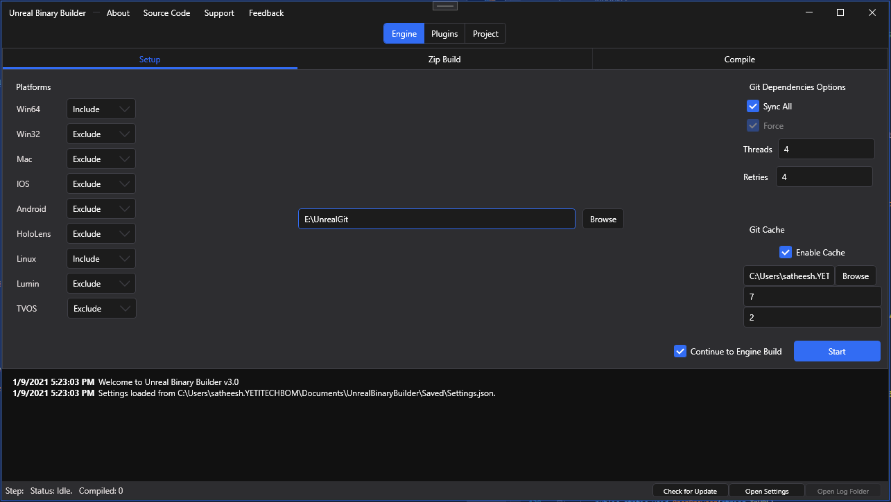
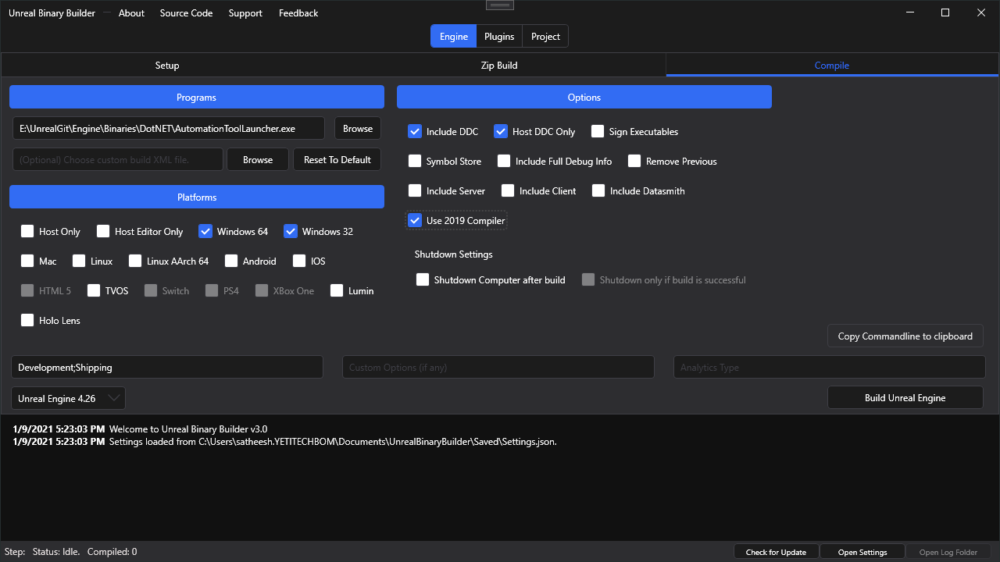

Unreal Engine Binary Builder
======================

This is a small app designed to create binary build of [Unreal Engine](https://www.unrealengine.com/) from [GitHub source](https://github.com/EpicGames/UnrealEngine).

 
  

 

Watch the below video to get an idea.

# How to use (Compiling Engine)

###### Step I 
- Download the latest release of Unreal Binary Builder.

###### Step II
- Clone or Download UE4 source from github.

###### Step III
- Open Unreal Binary Builder.
- Click *Browse* and select **root folder** of your downloaded Engine (where **_Setup.bat_** and **_GenerateProjectFiles.bat_** exists).

- Once the root folder is selected, click **Start**.
- If **Continue to Engine Build** is enabled, then _Unreal Binary Builder_ will automatically continue to compile the Engine with given options under **Compile** tab.

###### Step IV
- Click **_Compile_** tab and set options for the Engine.

# Troubleshoot

**Bug with 4.25.4** 
There is a known issue with 4.25.4 where it fails to build with an error message: `AutomationException: Attempt to add file to temp storage manifest that does not exist (<Path To Engine>\cpp.hint)` This issue has been fixed in 4.26 but if you need to use 4.25.4 see this workaround by Bernard Rouhi: https://github.com/ryanjon2040/UE4-Binary-Builder/issues/26#issuecomment-718204352

**Access Denied on some files?** 
On Windows, just change the ownership to Users then try again. To change ownership on Windows, follow these steps
 - Right click on the UE4 folder, choose Properties
 - Switch to Security tab
 - Click on Advanced
 - Near the top, click on Change User
 - A new dialog will open, in the text box at bottom, type in "Users", then click Check Names
 - OK till the end.

   

#### Dependencies

[HandyControl](https://github.com/HandyOrg/HandyControl) by [HandyOrg](https://github.com/HandyOrg)

[DotNetZip](https://github.com/haf/DotNetZip.Semverd) by [Henrik](https://github.com/haf)/Dino Chiesa

[GameAnalytics](https://github.com/GameAnalytics/GA-SDK-C-SHARP) by [Game Analytics](https://gameanalytics.com/)

[Json.NET](https://github.com/JamesNK/Newtonsoft.Json) by [Newtonsoft](https://www.newtonsoft.com/json)

[Sentry.NET](https://github.com/getsentry/sentry-dotnet) by [Sentry](https://sentry.io/)

[AutoGrid](https://github.com/SpicyTaco/SpicyTaco.AutoGrid) by [SpicyTaco](https://github.com/SpicyTaco)

[LogViewer](https://stackoverflow.com/a/16745054) by [Federico Berasategui](https://stackoverflow.com/users/643085/federico-berasategui)

[NetSparkle](https://github.com/NetSparkleUpdater/NetSparkle) by [NetSparkleUpdater](https://github.com/NetSparkleUpdater)

Icons made by <a href="https://www.flaticon.com/authors/freepik" title="Freepik">Freepik</a> from <a href="https://www.flaticon.com/" title="Flaticon">www.flaticon.com</a>a
